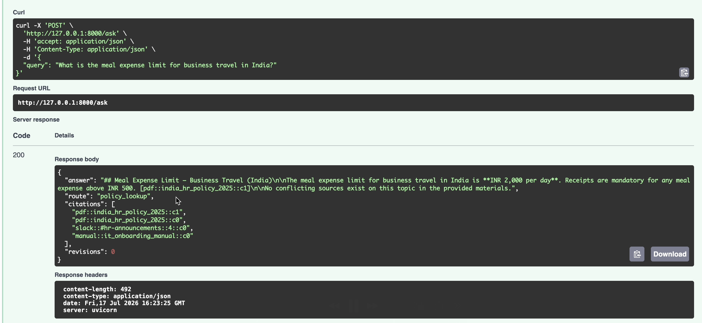
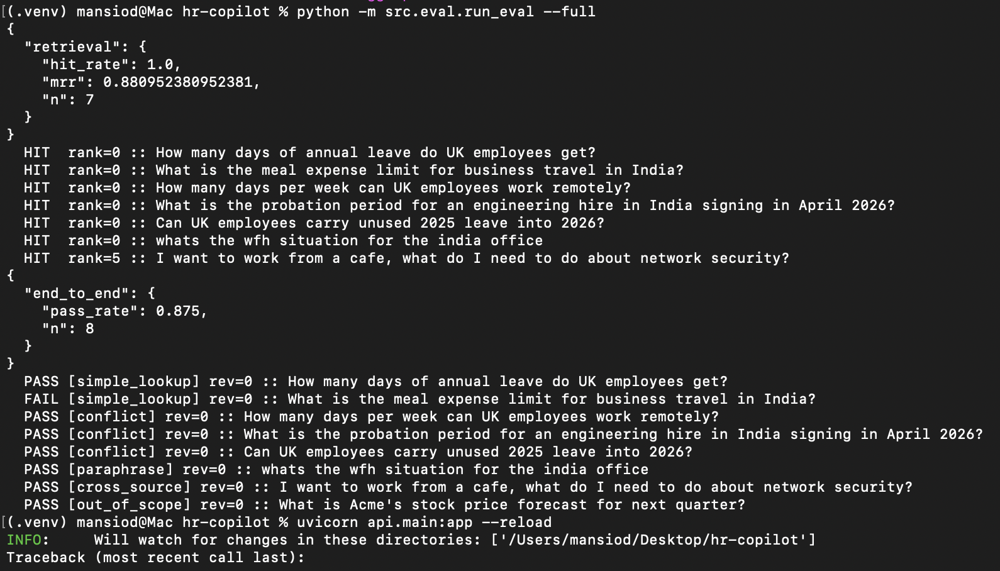
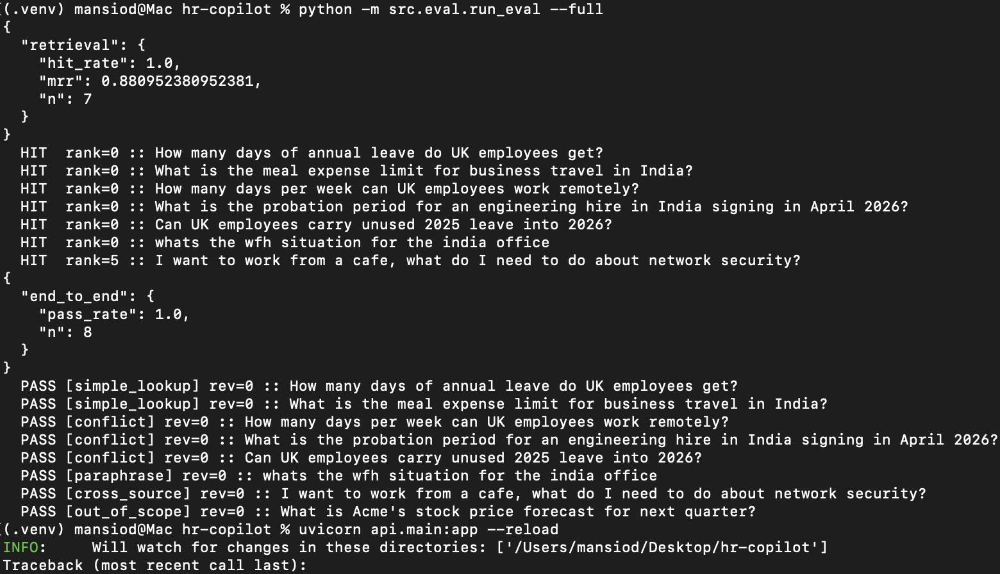

# HR Policy Copilot

Multi-agent RAG over messy, conflicting enterprise data. Built with LangGraph, the Anthropic API, hybrid retrieval (BM25 + optional dense embeddings), a two-layer evaluation harness, and a deployable FastAPI service.

## The problem this actually solves

Real company knowledge doesn't live in one clean document. It lives in:

- **PDF handbooks** that go stale the moment they're published
- **Slack announcements** that silently supersede the handbooks
- **Manuals** that reference both and sometimes contradict them
- Different rules per **region** (UK vs India here)

A naive RAG bot retrieves whatever matches and confidently answers from the stale source. This system is built around that failure mode: retrieval deliberately surfaces *conflicting* sources, and the agent graph is responsible for detecting the conflict, applying a precedence policy (dated announcements > older handbooks; regional > global), and citing what superseded what.

Try it: "How many days per week can UK employees work remotely?" The 2024 handbook says 2. A Slack announcement from HR says 3 from Jan 2026. The correct answer is 3, with the conflict surfaced — and the eval suite fails the build if that stops working.



Current baseline: **hit-rate 1.00, MRR 0.88** on the retrieval layer.

### The eval catching a real bug

First full end-to-end run: 7/8. The India meal-expense case failed even though
retrieval was perfect (rank 0).



Inspecting the live answer showed the system was right ("INR 2,000 per day",
correctly cited) — the eval's substring check for "2000" was brittle against
the thousands separator. Fixed the test, not the model:



That's the point of the harness: it flagged a discrepancy, retrieval metrics
localized it to the generation layer, and inspection showed a false negative
in the eval itself.


## Architecture

```
                    ┌─────────┐
     query ──────►  │ router  │  classify + extract region + rewrite query
                    └────┬────┘
              out_of_scope│policy_lookup / conflict_check
                ┌─────────┤
                ▼         ▼
          (refusal)  ┌──────────┐
                     │retriever │  hybrid BM25(+dense) search, RRF fusion,
                     └────┬─────┘  soft region filter, provenance packaging
                          ▼
                    ┌───────────┐
              ┌────►│synthesizer│  answer ONLY from sources, cite chunk_ids,
              │     └────┬──────┘  apply precedence rules
       revise │          ▼
       (max 1)│     ┌────────┐
              └─────┤ critic │  LLM-as-a-judge: grounding + conflict handling
                    └────┬───┘
                     pass▼
                    ┌────────┐
                    │finalize│ ──► answer + citations + trace
                    └────────┘
```

**Pipeline stages:** ingestion (3 source systems → common `RawDoc` envelope with provenance) → structure-aware chunking (section boundaries, Slack messages atomic) → hybrid index (BM25 + optional sentence-transformers, fused with Reciprocal Rank Fusion) → LangGraph agent graph → FastAPI → Docker.

## Quickstart

```bash
git clone <this-repo> && cd hr-copilot
pip install -r requirements.txt

# 1. Build the index from the sample data
python scripts/build_index.py

# 2. Run retrieval evals (no API key needed)
python -m src.eval.run_eval

# 3. Run the full agent (needs a key)
export ANTHROPIC_API_KEY=sk-ant-...
python -m src.eval.run_eval --full

# 4. Serve it
uvicorn api.main:app --reload
curl -X POST localhost:8000/ask -H 'Content-Type: application/json' \
  -d '{"query": "Can UK employees carry unused 2025 leave into 2026?"}'
```

Or with Docker:

```bash
docker compose up --build
```

## Evaluation: the part most RAG demos skip

Two layers, run at different costs:

**Layer 1 — retrieval (deterministic, free, runs in CI on every push):**
hit-rate@6 and MRR against a golden dataset. The CI gate fails the build if hit-rate drops below 0.85 or MRR below 0.6, so retrieval regressions are caught before merge, not in production.

**Layer 2 — end-to-end (LLM required, run before releases):**
runs the full graph against the golden set and checks: required facts present, out-of-scope queries refused, and — the hard one — conflicts explicitly surfaced when sources disagree.

The golden dataset is deliberately balanced across failure modes, not happy paths: simple lookups, three distinct conflict cases, a paraphrase query with zero keyword overlap with the sources ("wfh situation" — that phrase appears nowhere in the data), a cross-source security question, and an out-of-scope trap.

Current baseline: **hit-rate 1.00, MRR 0.88** on the retrieval layer.

## Design decisions worth arguing about

- **LangGraph over CrewAI:** explicit typed state and conditional edges make each node unit-testable and the control flow auditable. Role-play abstractions hide exactly the things you need to see when debugging production agents.
- **One revision loop, hard-capped:** the critic can send the draft back to the synthesizer once. Unbounded self-correction loops are a cost and latency trap, and in practice a second revision rarely fixes what the first didn't.
- **BM25 as the default retriever, dense as opt-in:** policy text is terminology-heavy, exact-match matters, and a zero-embedding-infra default means the whole eval layer runs in CI for free. RRF fuses the two without score calibration when dense is enabled.
- **Provenance is first-class:** every chunk carries source system, region, and timestamp from ingestion onward, because conflict resolution is impossible without knowing where and when a statement came from.
- **Slack noise filtering is channel-aware:** announcement channels are kept in full; known chatter channels are dropped unless a policy keyword appears. There's a test that fails if #random leaks into the index.

## Repo layout

```
src/ingestion/   loaders.py (PDF/Slack/MD → RawDoc), chunking.py
src/index/       store.py (HybridIndex: BM25 + optional dense, RRF)
src/agents/      graph.py (LangGraph: router → retriever → synthesizer → critic)
src/eval/        golden.py (balanced golden set), run_eval.py (two-layer harness)
api/             main.py (FastAPI: /ask /health /sources)
data/raw/        sample messy sources (3 PDFs, Slack export, 2 manuals)
tests/           pipeline unit tests (run in CI)
scripts/         build_index.py
.github/         CI: tests + retrieval eval gate on every push
```

## Extending it

Ideas in rough order of value: swap the pickle index for pgvector or Chroma behind the same `HybridIndex` interface; add LangSmith tracing to the graph; ingest a real Slack export via the API; add a `conflict_report` endpoint that proactively lists contradictions between sources; generate synthetic golden cases for rare policy areas.
